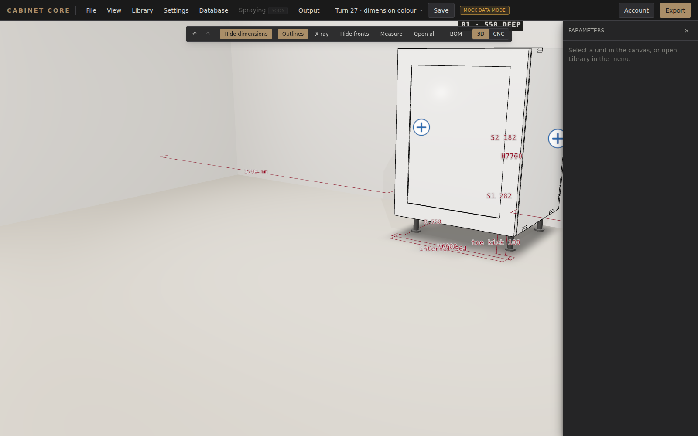
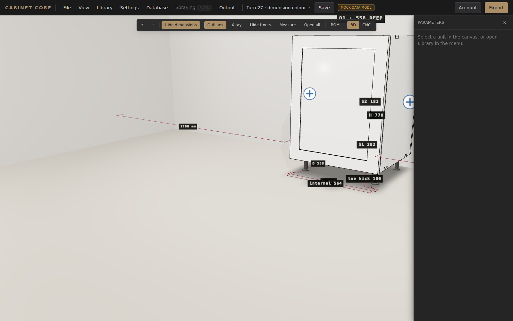

# Turn 27 F4 — the dimensions go back to black

R12's first debt, and the picture that pays it.

Turn 26 was asked to give shelves, sides and fronts the partition chain's
**behaviour**. It did that, and it was right to: `3d/DimensionChain.jsx` is the
one dimension component and R11 stands. On the way it also **repainted every
label**, and nobody asked for that.

> **R12. EXTEND MEANS EXTEND.** When the owner asks for a behaviour to reach
> further […] the LOOK does not change.

---

## What the paint was, and what it became

| | turn 25 — the partition chain | turn 26 | turn 27 |
| --- | --- | --- | --- |
| ground | `#1c1c1a`, square, at 0.9 alpha | none | `#1c1c1a`, square, at 0.9 alpha |
| ink | `#e8e4dc` | the LINE's own colour | `#e8e4dc` |
| edge | none — the plate IS the edge | a 6 px white halo | none |
| type | letter-spaced 600 monospace | plain 600 monospace | letter-spaced 600 monospace |
| height | 0.055 × 0.8 = **0.044** | 0.042 | **0.044** |
| lives in | `3d/constants.js` | hard-coded in the component | **`profile.hoverDimensions.label`** |

The two tones are the app's own and have not moved since turn 17: the shell the
panels are drawn in, and the ink they print in. "Restore" is a fact here rather
than an intention — the hexes are byte-for-byte the ones turn 25's flat
`DimLabel` filled with.

One thing is deliberately *not* restored: the label no longer lives in
`3d/constants.js`. It is a **profile block** now, so a workshop that wants a
different plate changes a value instead of a component, and every surface still
gets one answer from one call (`dimensionStyle`). That is R11 said about the
paint as well as about the geometry.

---

## The pictures — same project, same cabinet, same camera

`scripts/t27-dimensions-colour.mjs` drives **two builds of the app** through one
script: the turn-26 baseline (`8c0ece5`) and this branch, with the same project,
the same 600 mm base unit with two shelves, "show all dimensions" on, and the
camera placed at the same point in both. The only variable is the paint.

| | |
| --- | --- |
|  | **BEFORE** — turn 26. Every number is the line's own ink on a white halo, the debt R12 names. |
|  | **AFTER** — turn 27. The dark plate is back, on every chain: the width and the depth on the floor, the height and both shelf lights down the side. |

`4a-the-dimension-labels-after-f4.png` is the same paint photographed inside the
acceptance walk, on a cabinet with a shaker door beside it, so the plate can be
read against furniture rather than against a bare box.

`dimensions-colour.json` carries the camera and the chain count each build drew,
so the two pictures can be shown to be of the same thing.

---

## What did NOT change

The unification stays, exactly as turn 26 shipped it:

* **one component.** `test/turn27-f4-dimension-palette.test.js` asserts that
  `DistanceArrows`, `HoverDimensions` and `UnitView` paint no label of their own
  and that there is exactly one `CanvasTexture` in the scene's dimension code.
* **one geometry.** `engine/dimensionArrows.js dimensionSet` — witness lines,
  the dimension line, four open arrow strokes — untouched.
* **0.5 mm precision.** `formatDimension(2.5)` is still `2.5` and not `3`.
* **the two planes.** Horizontal chains still lie ON THE FLOOR in front of the
  run; vertical ones still run down the SIDE. Never across the face of a front.

And one small thing that is a decision rather than an omission: **the ink is the
plate's, not the line's.** A chain drawn in gold because its cabinet is selected
still turns gold — the strokes carry that — while its number stays light on dark
and legible. That is precisely how the partition chain behaved before turn 26,
and a gold word on a near-black ground is not a measurement anybody reads.
